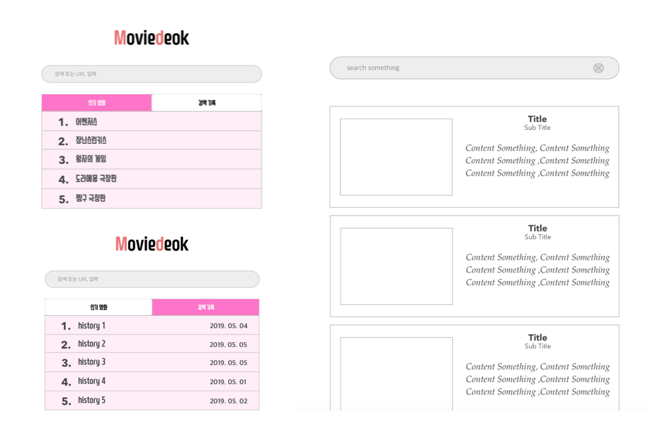

## 요구사항

###> 헤더 구현
##### ( ) 로그가 위에 위치할 수 있도록 할 것
##### ( ) 검색 결과가 있을 경우 로고가 사라진다.

###> 검색폼 구현
##### ( ) 검색어를 입력하면 X 버튼이 검색폼 오른쪽에 보인다.
##### ( ) 검색어가 없으면 X 버튼을 숨긴다.
##### ( ) 검색폼이 헤더 밑에 위치한다.
##### ( ) 엔터를 입력하면 검색 결과를 보인다.
##### ( ) x버튼을 클릭하거나, 검색어를 삭제하면 검색 결과를 삭제한다.

###> 검색 결과 구현
##### ( ) 검색 결과가 검색폼 아래 위치한다.
##### ( ) 검색 결과가 보인다.
##### ( ) x버튼을 클릭 => 검색폼이 초기화 & 검색결과 사라진다.

##### 탭 구현 (인기 랭킹, 검색 기록)
##### ( ) 인기 랭킹, 최근 검색어 탭이 검색폼 아래 위치
##### ( ) 기본으로 추천 검색어 탭을 선택
##### ( ) 각 탭을 클릭하면 탭 아래 내용을 탭이결정된다.

###> 인기 랭킹
##### ( ) 번호, 추천 검색어 목록이 탭 아래 위치한다.
##### ( ) 목록에서 검색어를 클릭하면 선택된 검색어 검색 결과 화면으로 이동
##### ( ) 선택된 검색어를 검색기록에 추가

###> 검색 기록
##### ( ) 검색 기록, 목록이 탭 아래에 위치한다.
##### ( ) 검색일자, 검색어, x버튼 표시
##### ( ) 목록에서 검색어를 클릭하면 선택된 검색어로 검색결과 표시
##### ( ) 검색시 검색 기록 목록에 추가 될 것

